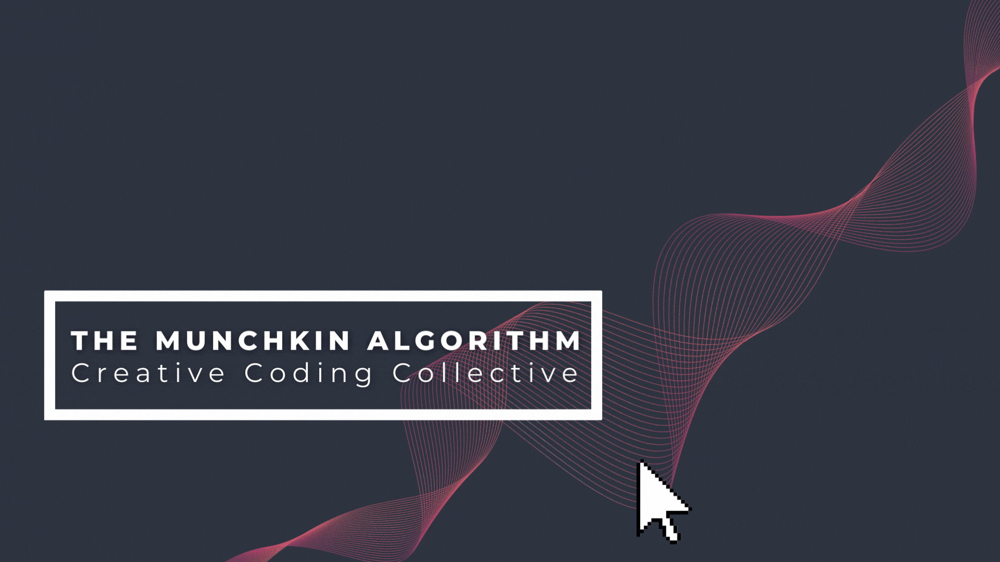

# The Munchkin Algorithm

Welcome to **The Munchkin Algorithm** – a collective of creative coders passionate about merging art and technology. Our mission is to explore the fascinating world of generative art, sound engineering, and innovative algorithmic processes.

## 🌟 About Us

At The Munchkin Algorithm, we believe in the synergy between creativity and coding. We experiment with various techniques and tools to create unique artistic expressions. Our projects span a wide range of disciplines including:

- **Generative Art**: Leveraging algorithms to create stunning visual art.
- **Sound Engineering**: Exploring the intersection of music, sound, and technology.
- **Creative Coding**: Writing code that goes beyond functionality to achieve artistic goals.

## 🛠 Technologies We Use

Our collective employs a diverse set of tools and technologies to bring our creative visions to life:

- **Languages**: Python, JavaScript, Processing, p5.js
- **Frameworks and Libraries**: TensorFlow, OpenCV, Matplotlib, Numpy, Web Audio API
- **Software**: Logic Pro, ProTools, Adobe Creative Suite, Blender

## 📝 Articles

Our collective writes articles about creative coding, and using programming tools for artistic purposes.

## 🎨 Featured Projects

### Generative Art Gallery
A collection of algorithmically generated artworks, each piece a testament to the beauty of code.

### SoundScape
An innovative project that uses machine learning to create immersive soundscapes based on environmental data.

### Code & Canvas
A series of interactive installations that blend physical art with digital interactivity.

## 📚 Resources

- [Generative Art: A Practical Guide](https://generativeartlink.com)
- [The Algorithmic Beauty of Plants](https://algorithmicbeauty.com)
- [Creative Coding for the Curious](https://creativecoding.com)

## 🤝 Join Us

Are you a creative coder interested in joining our collective? We are always looking for passionate individuals to collaborate with. Feel free to reach out through our [contact form](https://contactuslink.com) or connect with us on [Twitter](https://twitter.com/munchkinalgorithm).

## 📬 Stay in Touch

- **Newsletter**: Subscribe to our [newsletter](https://newsletterlink.com) for the latest updates.
- **Discord**: Join our [Discord community](https://discordlink.com) to chat with fellow creative coders.

## 👏 Acknowledgements

A big thank you to all our contributors and supporters. Your passion and creativity drive The Munchkin Algorithm forward.

## 📄 License

This repository is licensed under the MIT License. See the [LICENSE](LICENSE) file for more details.

---

*Crafted with ❤️ by The Munchkin Algorithm Collective.*

